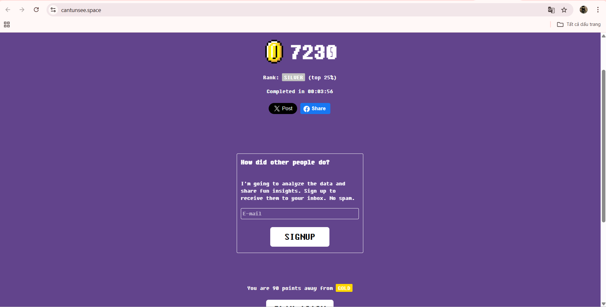
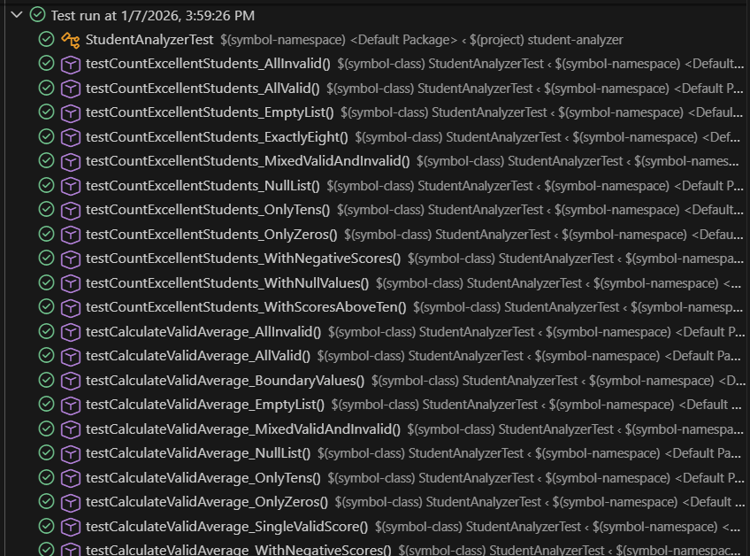

# 👁️ Báo Cáo Thực Hành: Kiểm Thử Thị Giác (Visual Testing)

 

## 1. Tổng quan
Repository này lưu trữ kết quả thực hành bài tập môn **Kiểm thử phần mềm**, tập trung vào kỹ năng kiểm thử giao diện (UI/UX) thông qua nền tảng [CantUnsee](https://cantunsee.space/).

## 2. Mục đích
* **Rèn luyện "mắt nghề nghiệp":** Phát hiện các lỗi giao diện nhỏ nhất (padding, typography, contrast, alignment...).
* **Tư duy thiết kế:** Nâng cao nhận thức về tính nhất quán (consistency) và trải nghiệm người dùng trong phát triển phần mềm.

## 3. Các bước thực hiện
1.  Truy cập nền tảng [CantUnsee](https://cantunsee.space/).
2.  Hoàn thành 3 cấp độ thử thách: **Easy, Medium, Hard**.
3.  Phân tích sự khác biệt giữa hai phiên bản thiết kế.
4.  Ghi nhận kết quả và chụp màn hình minh chứng.

## 4. Kết quả đạt được & Minh chứng
* ✅ **Trạng thái:** Đã hoàn thành toàn bộ các bài test.
* 🏆 **Điểm số:** [Điền điểm của bạn, ví dụ: 7230/8000]

### 📸 Ảnh minh họa kết quả



> **Nhận xét cá nhân:** Qua bài tập này, em nhận thấy các lỗi về *Alignment (Căn chỉnh)* và *Typography (Kiểu chữ)* là khó phát hiện nhất nếu không quan sát kỹ lưỡng pixel-perfect.

## 5. Thông tin sinh viên
| Thông tin | Chi tiết |
| :--- | :--- |
| **Họ tên** | Dư Văn Sang |
| **MSSV** | BIT230361 |
| **Lớp** | 23IT-SOFT5 |
| **Giảng viên** | Ths. Trương Anh Hoàng |

# 🧪 Bài tập Unit Test: Student Analyzer

  

## 1. Giới thiệu
Dự án thực hành môn **Kiểm thử phần mềm**, tập trung vào việc viết Unit Test tự động cho các hàm xử lý dữ liệu điểm số học sinh nhằm đảm bảo tính đúng đắn và xử lý ngoại lệ.

## 2. Chức năng chính
Chương trình `StudentAnalyzer` cung cấp các API xử lý:
1.  **`countGoodStudents(List<Double> scores)`**: Đếm số lượng học sinh có điểm `>= 8.0` (Bỏ qua các điểm không hợp lệ < 0 hoặc > 10).
2.  **`calculateAverage(List<Double> scores)`**: Tính trung bình cộng các điểm hợp lệ.

## 3. Cấu trúc dự án
```text
Unit_test/
├── src/
│   └── StudentAnalyzer.java       # Source code chính (Logic xử lý)
├── test/
│   └── StudentAnalyzerTest.java   # Code kiểm thử (Unit Tests)
├── target/                        # Thư mục build (tự động sinh ra)
├── pom.xml                        # Cấu hình Maven
└── README.md
```

## 4. Cách chạy kiểm thử

### 4.1. Sử dụng Maven (Command Line)

```bash
# Biên dịch project
mvn clean compile

# Chạy tất cả test cases
mvn test

# Chạy một test cụ thể
mvn test -Dtest=StudentAnalyzerTest
```

### 4.2. Sử dụng VS Code

1. Mở project trong **VS Code**
2. Mở file `test/StudentAnalyzerTest.java`
3. Nhấn nút **Run Test** (hình tam giác xanh) bên cạnh tên hàm test
4. Kết quả (✅ Pass/❌ Fail) sẽ hiện ra ngay lập tức

### 4.3. Chạy chương trình Demo

```bash
mvn compile exec:java "-Dexec.mainClass=StudentAnalyzer"
```

## 5. Kết quả kiểm thử

### 📊 Thống kê Test Coverage

| Test Suite | Total Tests | Passed | Failed | Coverage |
|------------|-------------|--------|--------|----------|
| **countExcellentStudents()** | 11 tests | ✅ 11 | ❌ 0 | 100% |
| **calculateValidAverage()** | 12 tests | ✅ 12 | ❌ 0 | 100% |
| **Tổng cộng** | **23 tests** | **✅ 23** | **❌ 0** | **100%** |

### 📸 Ảnh minh họa kết quả



### ✅ Các trường hợp đã kiểm thử

**Trường hợp bình thường:**
- Danh sách có điểm hợp lệ và không hợp lệ
- Danh sách toàn bộ hợp lệ

**Trường hợp biên:**
- Danh sách rỗng
- Danh sách null
- Điểm ở ngưỡng (0, 8.0, 10)

**Trường hợp ngoại lệ:**
- Điểm âm (< 0)
- Điểm vượt quá (> 10)
- Giá trị null trong danh sách

## 6. Công nghệ sử dụng

- **Java**: 11+
- **JUnit**: 5.10.1 (JUnit Jupiter)
- **Maven**: 3.x
- **Build Tool**: Maven Surefire Plugin

## 7. Tài liệu tham khảo

- [JUnit 5 User Guide](https://junit.org/junit5/docs/current/user-guide/)
- [Maven Testing Guide](https://maven.apache.org/guides/getting-started/)

---

# 🌐 Bài tập E2E Test: Cypress Testing

  

## 1. Giới thiệu

Dự án thực hành **Kiểm thử End-to-End (E2E)** với Cypress cho trang web mẫu [SauceDemo](https://www.saucedemo.com) - một cửa hàng trực tuyến để thực hành automation testing.

## 2. Chức năng kiểm thử

### 📝 Login Tests (4 tests)
- ✅ Đăng nhập thành công
- ❌ Đăng nhập thất bại
- 🔒 Kiểm tra trường rỗng

### 🛒 Cart Tests (6 tests)
- ➕ Thêm sản phẩm vào giỏ hàng
- ➖ Xóa sản phẩm khỏi giỏ hàng
- 🔢 Sắp xếp sản phẩm
- 📊 Kiểm tra giỏ hàng chi tiết

### 💳 Checkout Tests (5 tests)
- 📝 Quy trình thanh toán đầy đủ
- ✅ Hoàn tất đơn hàng
- ⚠️ Validation thông tin
- 💰 Tính tổng tiền

## 3. Cấu trúc dự án

```text
cypress-exercise/
├── cypress/
│   ├── e2e/
│   │   ├── login_spec.cy.js      # Test đăng nhập (4 tests)
│   │   ├── cart_spec.cy.js       # Test giỏ hàng (6 tests)
│   │   └── checkout_spec.cy.js   # Test thanh toán (5 tests)
│   ├── support/
│   │   ├── e2e.js               # Support file
│   │   └── commands.js          # Custom commands
│   ├── videos/                  # Video test runs
│   └── screenshots/             # Screenshots khi fail
├── cypress.config.js            # Cấu hình Cypress
├── package.json
└── README.md
```

## 4. Cách chạy test

### 4.1. Cài đặt dependencies (chỉ lần đầu)

```bash
cd cypress-exercise
npm install
```

### 4.2. Chạy test với giao diện (Test Runner)

```bash
npm run test:open
```

Sau đó:
1. Chọn **"E2E Testing"**
2. Chọn trình duyệt (Chrome khuyên dùng)
3. Click vào file test để chạy

### 4.3. Chạy test tự động (Headless)

```bash
# Chạy tất cả tests
npm test

# Chạy một file cụ thể
npx cypress run --spec "cypress/e2e/login_spec.cy.js"

# Chạy với Chrome
npm run test:chrome

# Chạy và hiển thị trình duyệt
npm run test:headed
```

## 5. Kết quả kiểm thử

### 📊 Thống kê Test Cases

| File Test | Số Tests | Trạng thái | Thời gian |
|-----------|----------|------------|-----------|
| login_spec.cy.js | 4 | ✅ Pass | ~5s |
| cart_spec.cy.js | 6 | ✅ Pass | ~12s |
| checkout_spec.cy.js | 5 | ✅ Pass | ~18s |
| **Tổng cộng** | **15** | **✅ 15/15** | **~35s** |

### 🎬 Tính năng Cypress

- ⏱️ **Time Travel**: Xem lại từng bước test
- 📸 **Auto Screenshots**: Chụp màn hình khi fail
- 🎥 **Video Recording**: Ghi lại toàn bộ test
- 🔍 **Real-time Reload**: Test chạy lại khi code thay đổi
- 🐛 **Debug Mode**: Console log đầy đủ

---

## 📞 Thông tin liên hệ

**Sinh viên thực hiện:** Dư Văn Sang  
**MSSV:** BIT230361  
**Lớp:** 23IT-SOFT5  
**Giảng viên:** Ths. Trương Anh Hoàng

---

**© 2026 - Bài tập thực hành môn Kiểm thử phần mềm** 
