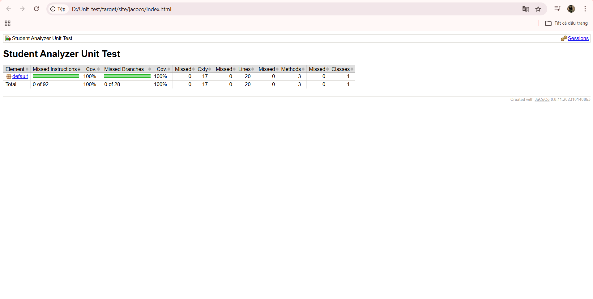

#  Báo Cáo Thực Hành: Kiểm Thử Thị Giác 


## 1. Tổng quan
Kho dữ liệu này lưu trữ kết quả thực hành bài tập môn **Kiểm thử phần mềm**, tập trung vào kỹ năng kiểm thử giao diện (UI/UX) thông qua nền tảng [CantUnsee](https://cantunsee.space/).

## 2. Mục đích
* **Rèn luyện "mắt nghề nghiệp":** Phát hiện các lỗi giao diện nhỏ nhất .
* **Tư duy thiết kế:** Nâng cao nhận thức về tính nhất quán và trải nghiệm người dùng trong phát triển phần mềm.

## 3. Các bước thực hiện
1.  Truy cập nền tảng [CantUnsee](https://cantunsee.space/).
2.  Hoàn thành 3 cấp độ thử thách: **Dễ, Trung bình, Khó**.
3.  Phân tích sự khác biệt giữa hai phiên bản thiết kế.
4.  Ghi nhận kết quả và chụp màn hình minh chứng.

## 4. Kết quả đạt được & Minh chứng
* **Trạng thái:** Đã hoàn thành toàn bộ các bài test.
*  **Điểm số:** 7230/8000

###  Ảnh minh họa kết quả


> **Nhận xét cá nhân:** Qua bài tập này, em nhận thấy các lỗi về *Căn chỉnh* và *Kiểu chữ* là khó phát hiện nhất nếu không quan sát kỹ lưỡng pixel-perfect.


#  Bài tập Kiểm thử đơn vị: Phân tích sinh viên

    

## 1. Giới thiệu
Dự án thực hành môn **Kiểm thử phần mềm**, tập trung vào việc viết Unit Test tự động cho các hàm xử lý dữ liệu điểm số học sinh nhằm đảm bảo tính đúng đắn và xử lý ngoại lệ.

## 2. Chức năng chính
Chương trình `StudentAnalyzer` cung cấp các API xử lý:
1.  **`countGoodStudents(List<Double> scores)`**: Đếm số lượng học sinh có điểm `>= 8.0` (Bỏ qua các điểm không hợp lệ < 0 hoặc > 10).
2.  **`calculateAverage(List<Double> scores)`**: Tính trung bình cộng các điểm hợp lệ.

## 3. Cấu trúc dự án
```text
Unit_test/
├── src/
│   └── StudentAnalyzer.java       # Nguồn code chính (Logic xử lý)
├── test/
│   └── StudentAnalyzerTest.java   # Code kiểm thử (Unit Tests)
├── target/                        # Thư mục build (tự động sinh ra)
├── pom.xml                        # Cấu hình Maven
└── README.md
```

## 4. Cách chạy kiểm thử

### 4.1. Sử dụng Maven 

```bash
# Biên dịch project
mvn clean compile

# Chạy tất cả kiểm thử
mvn test

# Chạy kiểm thử cụ thể
mvn test -Dtest=StudentAnalyzerTest

# Tạo báo cáo JaCoCo coverage
mvn clean test
# Mở: target/site/jacoco/index.html
```

### 4.2. Sử dụng VS Code

1. Mở dự án trong **VS Code**
2. Mở tập tin `test/StudentAnalyzerTest.java`
3. Nhấn nút **Run Test** (hình tam giác xanh) bên cạnh tên hàm kiểm thử
4. Kết quả (Pass/Fail) sẽ hiện ra ngay lập tức

### 4.3. Chạy chương trình mẫu

```bash
mvn compile exec:java "-Dexec.mainClass=StudentAnalyzer"
```

## 5. Kết quả kiểm thử

### Thống kê kiểm thử

| Loại kiểm thử | Số lượng | Trạng thái | Kỹ thuật áp dụng |
|-----------|----------|------------|------------------|
| Trường hợp bình thường | 10 | Đạt | Phân hoạch tương đương |
| Trường hợp biên | 13 | Đạt | Phân tích giá trị biên |
| Xử lý ngoại lệ | 6 | Đạt | Dự đoán lỗi |
| Kiểm thử bảng quyết định | 30 | Đạt | Kiểm thử hướng dữ liệu |
| **Tổng cộng** | **59** | **Đạt** | **Đầy đủ** |

### Ảnh minh họa kết quả


### Báo cáo độ bao phủ mã nguồn (JaCoCo)



**Chỉ số đạt được:**
- Độ bao phủ dòng lệnh: 100%
- Độ bao phủ nhánh: 100%
- Độ bao phủ phương thức: 100%

### Kỹ thuật kiểm thử đã áp dụng

**1. Phân hoạch tương đương**
- Phân hoạch dữ liệu thành các nhóm tương đương
- Kiểm thử đại diện cho từng nhóm

**2. Phân tích giá trị biên**
- Kiểm thử các giá trị biên: 0, 8.0, 10.0
- Kiểm thử giá trị epsilon: 7.999999, 8.000001

**3. Kiểm thử bảng quyết định**
- 15 trường hợp cho countExcellentStudents()
- 15 trường hợp cho calculateValidAverage()
- Sử dụng @ParameterizedTest và @MethodSource

**4. Xử lý ngoại lệ**
- Danh sách rỗng, danh sách null
- Điểm không hợp lệ (< 0, > 10)
- Dữ liệu hợp lệ và không hợp lệ trộn lẫn

## 6. Công nghệ sử dụng

- **Java**: 11+
- **JUnit**: 5.10.1 (Thư viện kiểm thử đơn vị)
- **Maven**: 3.x (Công cụ quản lý dự án)
- **JaCoCo**: 0.8.11 (Phân tích độ bao phủ mã nguồn)
- **Surefire Plugin**: 3.0.0 (Chạy kiểm thử tự động)

## 7. Tài liệu tham khảo

- [JUnit 5 User Guide](https://junit.org/junit5/docs/current/user-guide/)
- [Maven Testing Guide](https://maven.apache.org/guides/getting-started/)

---

# Bài tập Kiểm thử E2E: Kiểm thử Cypress


## 1. Giới thiệu

Dự án thực hành **Kiểm thử End-to-End (E2E)** với Cypress cho trang web mẫu [SauceDemo](https://www.saucedemo.com) - một cửa hàng trực tuyến để thực hành kiểm thử tự động.

## 2. Chức năng kiểm thử

### Kiểm thử đăng nhập (4 kiểm thử)
-  Đăng nhập thành công
-  Đăng nhập thất bại
-  Kiểm tra trường rỗng

###  Kiểm thử giỏ hàng (6 kiểm thử)
-  Thêm sản phẩm vào giỏ hàng
-  Xóa sản phẩm khỏi giỏ hàng
-  Sắp xếp sản phẩm
-  Kiểm tra giỏ hàng chi tiết

### Kiểm thử giỏ hàng (5 kiểm thử)
- Quy trình thanh toán đầy đủ
-  Hoàn tất đơn hàng
-  Xác thực thông tin
-  Tính tổng tiền

## 3. Cấu trúc dự án

```text
cypress-exercise/
├── cypress/
│   ├── e2e/
│   │   ├── login_spec.cy.js      # Kiểm thử đăng nhập (4 kiểm thử)
│   │   ├── cart_spec.cy.js       # Kiểm thử giỏ hàng (6 kiểm thử)
│   │   └── checkout_spec.cy.js   # Kiểm thử thanh toán (5 kiểm thử)
│   ├── support/
│   │   ├── e2e.js               # Tập tin hỗ trọ
│   │   └── commands.js          # Lệnh tùy chỉnh
│   ├── videos/                  # Video chạy kiểm thử
│   └── screenshots/             # ảnh chụp màn hình kiểm thử
├── cypress.config.js            # Cấu hình Cypress
├── package.json
└── README.md
```

## 4. Cách chạy kiểm thử

### 4.1. Cài đặt thư viện phụ thuộc (chỉ lần đầu)

```bash
cd cypress-exercise
npm install
```

### 4.2. Chạy kiểm thử với giao diện (Test Runner)

```bash
npm run test:open
```

Sau đó:
1. Chọn **"E2E Testing"**
2. Chọn trình duyệt (Chrome khuyên dùng)
3. Nhấp vào tập tin kiểm thử để chạy

### 4.3. Chạy kiểm thử tự động 

```bash
# Chạy tất cả kiểm thử
npm test

# Chạy một tập tin cụ thể
npx cypress run --spec "cypress/e2e/login_spec.cy.js"

# Chạy với Chrome
npm run test:chrome

# Chạy và hiển thị trình duyệt
npm run test:headed
```

## 5. Kết quả kiểm thử

### Thống kê trường hợp kiểm thử

| Tập tin kiểm thử | Số kiểm thử | Trạng thái | Thời gian |
|-----------|----------|------------|-----------|
| login_spec.cy.js | 4 | Pass | ~5s |
| cart_spec.cy.js | 6 | Pass | ~12s |
| checkout_spec.cy.js | 5 | Pass | ~18s |
| **Tổng cộng** | **15** | 15/15| **~35s** |

### Tính năng Cypress

-  **Xem lại lịch sử thực thi**: Xem lại từng bước kiểm thử
- **Tự động chụp màn hình**: Chụp màn hình khi thất bại
-  **Ghi lại video kiểm thử**: Ghi lại toàn bộ kiểm thử
-  **Tải lại theo thời gian thực**: Kiểm thử chạy lại khi code thay đổi
-  **Chế độ gỡ lỗi**: Console log đầy đủ

---

##  Thông tin liên hệ

**Sinh viên thực hiện:** Dư Văn Sang  
**MSSV:** BIT230361  
**Lớp:** 23IT-SOFT5  
**Giảng viên:** Ths. Trương Anh Hoàng

---

**© 2026 - Bài tập thực hành môn Kiểm thử phần mềm** 
